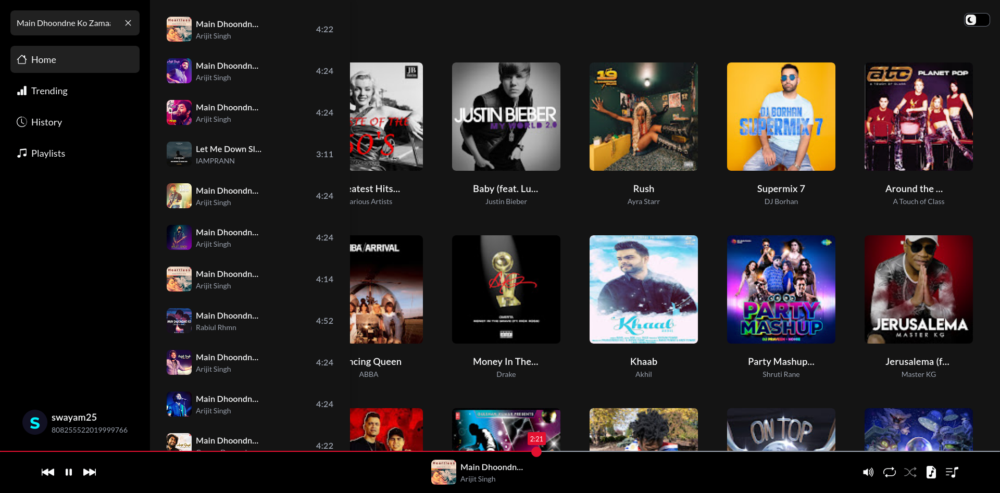
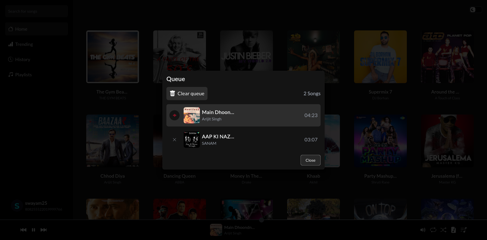
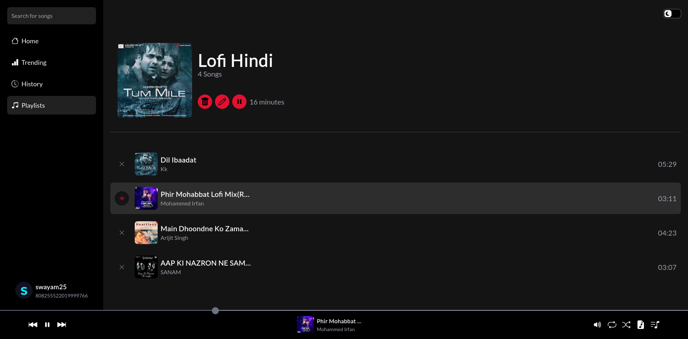
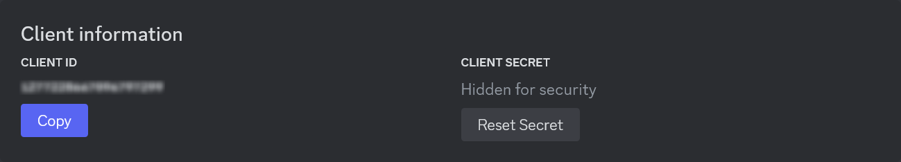
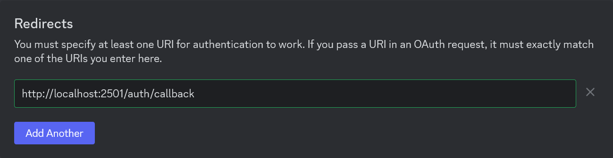

<div align="center">


Amplify your moments

</div>

## 🎬 Preview

- **Main Page**

    

- **Queue**

    

- **Playlist**

    

## 📚️ Documentation

Get full documentation of internal workings [here](../../wiki)

## 🚀 Installation

1. Clone this repository
    ```sh
    git clone <repository url> rythmify
    cd rythmify
    ```

2. Install dependencies
    - Backend
        ```sh
        cd server
        python -m venv .venv
        source .venv/bin/activate
        pip install -r requirements.txt
        ```

    - Frontend
        ```sh
        cd client
        npm i
        ```

3. Configure the [`config.json`](./config.json) file

    <details>

    <summary>Configuration</summary>

    - `discord`
        - `client_id`: Discord OAuth2 Client ID
        - `client_secret`: Discord OAuth2 Client Secret

    - `server`: Backend server url

    - `client`: Frontend client url

    </details>

4. Copy the `Client ID` and `Client Secret` from the Discord Developer Portal and paste them into the `client_id` and `client_secret` fields, respectively, in the [`config.json`](./config.json) file
    

5. Add the `http://localhost:2501/auth/callback` to the Discord OAuth2 Redirect URIs
    

6. Start the app
    - Backend
        ```sh
        cd server
        source .venv/bin/activate
        python -m uvicorn main:app --host localhost --port 2501
        ```
    - Frontend
        ```sh
        cd client
        npm run dev -- --host --port 2500
        ```

7. URLs
    - Backend: `http://localhost:2501`
    - Frontend: `http://localhost:2500`
